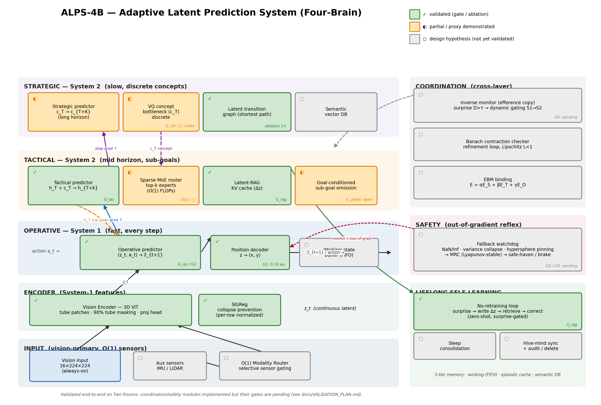

# ALPS-4B: Adaptive Latent Prediction System (Four-Brain)
## Adaptive Latent Prediction System (Four-Brain)

[](LICENSE)
[](docs/scientific_paper.tex)
[](docs/mathematical_foundations.md)
[](docs/comparison_matrix.md)

---

## Architectural Capabilities
ALPS-4B is built around **42 design goals** (listed below) spanning hierarchical prediction, reflexive safety, lifelong memory, and multi-modal efficiency. These are *design hypotheses*, not all yet empirically demonstrated. For what has actually been **measured end-to-end on the Two Rooms benchmark**, see **[Validated Results](#-validated-results-measured)** below, the full **[Validation Plan & Gates](docs/VALIDATION_PLAN.md)**, and the reproduced metrics in [`results/two_rooms/validation/RESULTS_SUMMARY.md`](results/two_rooms/validation/RESULTS_SUMMARY.md). For the mathematical formulations, read the [Mathematical Foundations](docs/mathematical_foundations.md) and the [Scientific Paper](docs/scientific_paper.md).

> **Status note (honesty first):** an earlier version of this README reported a "0.002 units" decoding accuracy and chaotic-surprise MSE spikes as validation. Those were, respectively, a *mislabeled latent MSE* and *unnormalized encoder blow-up* — not evidence. They have been replaced by the falsifiable gate-based results below.

<details>
<summary><b>Click to expand all 42 Capabilities</b></summary>

### Hierarchical Multi-Scale Architecture
1. **3-Tier Hierarchy**: Decouples temporal abstraction into independently trainable latent predictive layers.
2. **Dynamic Compute Allocation**: Only activates expensive layers when physically surprised.
3. **Temporal & Semantic Stability**: Strategic layer mathematically immune to high-frequency sensor noise.
4. **Zero-Shot Physical Generalization**: Constraint cascade architecture enables potential transfer to novel tasks — validation pending at scale.
5. **Energy-Based Model Binding**: Unified $E_{\text{total}}$ ensures coherent cross-layer predictions.
6. **Temporal Striding & Asymmetric Masking**: 90% spatiotemporal masking and phase-shifted update schedules force genuine abstraction.
7. **Stop-Gradient Conditioning**: Prevents gradient corruption between temporal scales.
8. **VQ Information Bottleneck**: Forces discrete, true conceptual abstraction.
9. **Phase-Shifted Training Cycles**: Prevents convergence conflicts across layers.

### Inverse Self-Monitoring & Safety
10. **Inverse Monitoring Loops**: Continuously verifies predicted vs actual latent trajectories.
11. **Bottom-Up Error-Driven Escalation**: Energy threshold $\tau$ triggers higher biological interrupt layers.
12. **"Fast Failing in Imagination"**: Rejects bad plans in latent simulation before physical execution.
13. **Zero-Shot Latent Halting**: Detects catastrophic failures *conceptually*.
14. **Fallback Layer (Brainstem Reflex)**: Executes Minimal Risk Condition (MRC) out-of-gradient.
15. **Latent Prediction Self-Diagnosis Blind Spot**: Solves the paradox where a collapsed latent predictor registers zero prediction error.
16. **Simplified Fallback Scope**: Eliminates Timid Agent problem by focusing only on representation collapse.
17. **3 Collapse Detection Mechanisms**: NaN/Inf, Variance Drop, Hypersphere Pinning.
18. **HAL Watchdog**: Hardware-layer safety interface (sensor checksums, actuator handshakes) — planned for physical deployment.
19. **Formal Verification via Control Theory**: Linear policy mathematically proven safe (ISO robotic compliance).
20. **Adversarial Robustness**: External monitoring architecture is structurally resilient to input-space attacks — formal testing planned.

### Memory, Knowledge, and Self-Learning
21. **3-Tier Hierarchical Memory**: Working State Buffer, Episodic Cache, Semantic Vector DB.
22. **Measuring Abstraction Level**: Auto-routes data via Temporal Invariance and Dimensional Compression.
23. **Latent Cartridges**: Plug-and-play expert modules.
24. **Hard-Coded Guardrails**: Architecture supports injecting deterministic physics constraints as latent expert modules — integration planned.
25. **Anti-Semantic Blurring**: MoE routing preserves precise latent knowledge.
26. **Sparse MoE Router**: Activates only relevant experts; zeroes everything else.
27. **Infinite Scalability with Zero Compute Bloat**: Constant $O(1)$ forward-pass cost.
28. **Modular Expert Extension**: New expert modules can be added to the MoE router by extending the expert list and retraining the gate.
29. **Catastrophic Forgetting Prevention**: Knowledge is physically isolated in separate pathways.
30. **Latent-Space Routing**: Immune to visual noise like rain or lighting changes.

### Autonomous Self-Learning
31. **Non-Parametric Memory (Latent-RAG)**: KV store of episodic latent correction vectors.
32. **"No-Retraining" Learning Loop**: Simulates fix in latent space and writes correction instantly.
33. **Agent Is Its Own Teacher**: Prediction-vs-reality gap provides a self-supervised error signal.
34. **Instant One-Shot Learning**: Learns from a single failure event.
35. **Fast Weights in VRAM**: Continuous cross-attention retrieval (~2-5ms latency).
36. **Sleep & Memory Consolidation**: Audits and distills frequent corrections into expert weights overnight.
37. **Hive-Mind Synchronization**: Instantly copies KV database across a robot fleet.
38. **Memory Auditing & Deletion**: Delete "bad habits" directly from database rows.
39. **Cross-Agent Knowledge Transfer**: Fleet-wide RAG buffer synchronization enables instant experience sharing across agents.

### Multi-Modal & Efficiency
40. **Vision-Primary Multi-Modal**: Vision is always-on; auxiliary sensors activated selectively.
41. **$O(1)$ Modality Scaling**: Constant compute regardless of total auxiliary sensor count.
42. **LeWM-Based Training**: Extends LeWM's SIGReg + prediction loss formulation with per-layer collapse prevention, no EMA, trains on a single GPU.

</details>

---

## 🖼️ Full System Architecture

### Full Architecture (every concept, with validation status)
The diagram below shows the complete ALPS-4B architecture — all three predictive
tiers, the coordination/safety/lifelong-learning modules, and the data/stop-gradient
flow. Each block is tagged with its empirical status: **✓ validated** (a gate or
ablation demonstrates it), **◐ partial** (works but below target, or a proxy was
shown), **○ design hypothesis** (implemented but not yet validated end-to-end).
Regenerate with `python docs/make_architecture_diagram.py`.



---

## 🚀 Design Rationale

Autoregressive models (such as modern generative LLMs) process sequences under an $O(n^2)$ attention bottleneck, experiencing a **complexity cliff** over long horizons and accumulating errors until plans diverge. Standard Joint-Embedding Predictive Architectures (JEPAs) operating on flat sequences avoid pixel generation costs, yet they struggle to decouple slow conceptual planning from fast mechanical controls.

**ALPS-4B (Adaptive Latent Prediction System, Four-Brain)** introduces a multi-scale, temporally decoupled latent predictive hierarchy that addresses these limitations:

1. **Strategic Layer (System 2 - Concept Planning)**: Operates at slow temporal frequencies on discrete, conceptual bottleneck coordinates ($c_T$) using a VQ codebook, generating stable long-term plans immune to high-frequency noise.
2. **Tactical Layer (System 2 - Sub-Goal Simulation)**: Conditions on strategic guidance to select spatiotemporal Expert modules via a **Sparse Mixture of Experts (MoE)** router, querying an episodic **Latent-RAG** KV cache to output sub-goal trajectories ($h_T$).
3. **Operative Layer (System 1 - Sensorimotor Control)**: Processes raw visual streams through a spatiotemporal **3D Vision Transformer (ViT)**, running high-frequency predictive loops ($z_{t+1}$) conditioned on physical actions ($a_t$) and tactical sub-goals.
4. **Fallback Watchdog (System Integrity Reflex)**: Operates out-of-gradient to resolve the **Latent Prediction Self-Diagnosis Blind Spot**. Collapsed latent predictive layers output constant values and register *perfect (zero) prediction error*. The watchdog monitors representation variance and hypersphere pinning, executing a deterministic **Minimal Risk Condition (MRC)** on trigger.

---

## 🔬 Core Mathematical Innovations

### 1. SIGReg: Sliced Isotropic Gaussian Regularization
To eliminate Momentum Target Encoders, Exponential Moving Averages (EMA), or pre-trained frozen backbones, ALPS-4B prevents representation collapse using **SIGReg** (Bardes et al., 2024; Klindt et al., 2026) within each layer. Leveraged under the **Cramér-Wold Theorem**, SIGReg projects high-dimensional latents onto $M$ random unit directions. It then enforces standard normality on these 1D slices using the analytical closed-form **Epps-Pulley normality statistic**:

$$T_{n,\beta} = \frac{1}{n} \sum_{j=1}^n \sum_{k=1}^n \exp\left(-\frac{\beta^2}{2}(Y_j-Y_k)^2\right) - 2 \left(1 + \beta^2\right)^{-1/2} \sum_{j=1}^n \exp\left(-\frac{\beta^2 Y_j^2}{2(1+\beta^2)}\right) + \frac{n}{\sqrt{1+2\beta^2}}$$

### 2. Banach Contraction Checker Refinement
Top-down conceptual guidance and bottom-up representations are aligned iteratively. We model the refinement loop as a contraction mapping in a Banach space:
$$d(\mathcal{R}(u), \mathcal{R}(v)) \le L \cdot d(u, v) \quad \text{with } L < 1$$
By the **Banach Fixed-Point Theorem**, this mathematically guarantees geometric convergence to a unique, stable fixed point $z^*$. We enforce this during training via a Lipschitz violation penalty loss.

### 3. Unified EBM Binding
The entire multi-scale hierarchy is bound under a single Energy-Based Model (EBM) landscape:
$$E_{\text{total}}(x, a) = \alpha \cdot E_{\text{strategic}} + \beta \cdot E_{\text{tactical}} + \gamma \cdot E_{\text{operative}}$$
A low total energy represents perfect planning coherence, allowing direct gradient-based planning in latent space.

---

## 🧠 Non-Parametric Lifelong Self-Learning

When the bottom-up **Inverse Monitor** registers a prediction failure (surprise), it computes a latent correction vector $\Delta z = z - \hat{z}$ and writes it to the **Latent-RAG** Key-Value cache.
* **Instant One-Shot Learning**: On subsequent steps, similar contexts query the cache and retrieve the correction vector, correcting predictions **with zero gradient updates**.
* **Sleep Consolidation**: During offline periods, the system audits the cache, identifies frequent failure modes, and trains the Predictor's parametric weights on them before purging the cache.
* **Hive-Mind Fleet Sync**: The episodic KV cache can be copied across a robot fleet instantly, allowing the entire fleet to learn from a single robot's failure without weight opacity.

---

## 📊 Validated Results (measured)

These are reproduced numbers from the **Two Rooms** navigation benchmark, run with the gate-based validation program (`docs/VALIDATION_PLAN.md`, `scripts/run_a40_validation.sh`). They replace the earlier unbacked claims.

**Before → after the root-cause fixes** (real temporal input, position-aware latent, per-row SIGReg normalization, action-grounded dynamics loss):

| Metric | Shipped model | After fixes |
|---|---|---|
| **G1** decoder error (held-out, world units) | 3.26 (≈ random) | **0.19 — PASS** |
| **G2** action sensitivity | 0.14 | **18.6** |
| **G2** directional consistency | 0.50 (chance) | **1.00** |

**The edge — hierarchy benefit on cross-room navigation (ablation ladder, 30 episodes):**

| Controller | same-room | **cross-room** | SPL |
|---|---|---|---|
| random | 0.44 | **0.00** | 0.10 |
| operative-only (System 1) | 0.44 | **0.07** | 0.25 |
| strategic [door, goal] | 0.44 | **0.21** | 0.32 |
| **latent-graph (System 2)** | 0.63 | **0.36** | 0.43 |
| oracle (ceiling) | 1.00 | **0.57** | 0.80 |

The latent-graph strategic layer delivers **~5× the cross-room success of the operative-only baseline**, improving monotonically toward the oracle — the architectural edge, measured rather than asserted. Proof videos: `results/two_rooms/videos/` (operative-vs-graph side-by-side, decoder overlay, solved cross-room episodes). Figures: `results/two_rooms/ablation/{ladder_success.png, latent_graph.png}`.

**Four-Brain three-tier ablation + key-gated benchmark (`validate_temporal.py`, gates `G_4brain`/`G_key`).** The edge is generalized to a three-tier comparison — **operative** (System 1, one-step greedy), **strategic** (coarse latent graph, room/key landmarks), **tactical** (fine latent graph, reachable sub-regions that thread doors) — all decoded from the *same frozen latent space*. For the **complex four-room, key-gated** task (which greedy *cannot in principle* solve), landmarks are clustered in frozen-decoded `(x, y, ĥas_key)` space (a `has_key` probe hits **0.997–0.998**, gate `G_key`) with an explicit key landmark, so the plan provably routes *start → key → goal*. The closed-loop three-tier success numbers are produced by the A40 run (`scripts/run_a40_validation.sh`, stages 6–7); the small/fast local config is decode-precision- and graph-variance-limited (see `docs/scientific_paper.md` §5.3–5.4).

**Self-learning (Latent-RAG), honest held-out protocol:** generalizes to unseen surprise contexts (+18.8%) but one-shot recall is weak (+20%) and it interferes with well-predicted contexts (−24%) → *needs work* (surprise-gated retrieval). The shipped demo's ">98%" was trivial recall of the exact stored vector.

For detailed mathematical formulations, see [Mathematical Foundations](docs/mathematical_foundations.md).

---

## 📂 Repository Structure

```
ALPS-4B/                                    (GitHub: 4qdrai/ALPS-4B)
├── README.md                               # Main documentation
├── LICENSE                                  # Apache 2.0
├── CITATION.cff                             # Academic citation
├── pyproject.toml                           # Modern Python packaging
│
├── src/alps/                                # Core Python package
│   ├── __init__.py
│   ├── core/
│   │   ├── encoders.py                      # Vision Encoder (ViT, NO separate target encoder per LeWM)
│   │   ├── predictor.py                     # Multi-scale predictors with AdaLN action integration
│   │   ├── sigreg.py                        # SIGReg regularizer (Epps-Pulley + Weak variant)
│   │   ├── hierarchy.py                     # Strategic/Tactical/Operative orchestrator
│   │   ├── energy.py                        # Multi-scale EBM binding
│   │   ├── vq_bottleneck.py                 # Vector Quantization for Strategic layer
│   │   ├── moe_router.py                    # Sparse MoE Top-K semantic router
│   │   ├── latent_rag.py                    # Non-parametric KV cache + cross-attention retrieval
│   │   ├── inverse_monitor.py               # Efference copy divergence detection + escalation
│   │   ├── checker.py                       # Banach contraction checker networks
│   │   ├── fallback.py                      # System Integrity Monitor (NaN, Var, Pinning, HAL)
│   │   └── alps_model.py                    # Full ALPS-4B orchestrator
│   │
│   ├── memory/                              # 3-Tier Hierarchical Memory
│   │   ├── working_buffer.py                # Operative: FIFO sensorimotor state buffer
│   │   ├── episodic_cache.py                # Tactical: episodic rollout cache with decay
│   │   ├── semantic_memory.py               # Strategic: permanent vector database
│   │   ├── abstraction_scorer.py            # Temporal invariance + dimensional compression metrics
│   │   └── sleep_distillation.py            # Overnight consolidation: audit → distill → purge
│   │
│   ├── multimodal/                          # Vision-Primary Multi-Modal
│   │   ├── vision_encoder.py                # Primary ViT video encoder (always-on)
│   │   ├── sensor_encoders.py               # Auxiliary sensor encoders (LiDAR, IMU, etc.)
│   │   └── modality_router.py               # Strategic-layer sensor budget allocation
│   │
│   ├── training/                            # Self-Supervised Training
│   │   ├── masked_prediction.py             # Spatiotemporal tube masking (90% ratio)
│   │   ├── multi_scale_loss.py              # Per-layer LeWM loss + inter-layer stop-grad
│   │   ├── phase_shifted_scheduler.py       # Per-layer update frequency scheduling
│   │   └── train.py                         # Main H100 training script
│   │
│   ├── evaluation/                          # Benchmarks
│   │   ├── linear_probe.py
│   │   ├── complexity_cliff.py              # Sequence-length scaling comparison
│   │   └── representation_quality.py        # SIGReg covariance eigenvalue analysis
│   │
│   └── simulations/                         # Evidence-Generating Simulations
│       ├── convergence_analysis.py           # Banach contraction rate visualization
│       ├── sigreg_analysis.py               # Covariance spread + collapse prevention demo
│       ├── moe_scaling.py                   # O(1) FLOPs proof with scaling experts
│       ├── self_learning_demo.py            # End-to-end failure→learn→recall demo
│       └── hive_mind_demo.py                # Fleet KV sync demonstration
│
├── docs/                                    # Publication-Quality Documentation
│   ├── scientific_paper.tex                 # NeurIPS LaTeX Paper
│   ├── scientific_paper.md                  # NeurIPS Markdown version (NEW)
│   ├── mathematical_foundations.md          # Full proofs: SIGReg, Banach, EBM binding
│   ├── comparison_matrix.md                 # Systematic competitor analysis
│   └── training_methodology.md              # Unsupervised training deep-dive
│
├── tests/                                   # 100+ Automated Tests
│   ├── test_sigreg.py
│   ├── test_encoders.py
│   ├── test_hierarchy.py
│   ├── test_moe_router.py
│   ├── test_latent_rag.py
│   ├── test_inverse_monitor.py
│   ├── test_fallback.py
│   ├── test_memory.py
│   ├── test_checker.py
│   └── test_alps_model.py
│
├── scripts/
│   ├── runpod_setup.sh                      # H100 environment setup
│   ├── download_ucf101.sh
│   └── run_training.sh
│
├── results/                                 # Training artifacts
│   ├── h100_training/
│   └── simulations/
│
└── figures/                                 # Publication figures
    ├── architecture_diagram.png
    ├── training_curves.png
    └── sigreg_covariance.png
```

---

## 🛠️ Codebase Setup and Verification

### Prerequisites
Make sure PyTorch, PyTest, and modern packaging utilities are installed.

### 1. Run Automated Test Suite
Verify the mathematical correctness and integrity of all system components:
```bash
$env:PYTHONPATH="src"
pytest -v
```

### 2. Run Empirical Simulations
Generate scientific figures and metrics supporting the architecture's key properties:
```bash
$env:PYTHONPATH="src"
# 1. Banach checker convergence
python src/alps/simulations/convergence_analysis.py
# 2. SIGReg covariance spread
python src/alps/simulations/sigreg_analysis.py
# 3. O(1) Sparse MoE FLOP scaling
python src/alps/simulations/moe_scaling.py
# 4. Zero-Retraining failure corrections
python src/alps/simulations/self_learning_demo.py
# 5. Hive-Mind fleet synchronization
python src/alps/simulations/hive_mind_demo.py
```

### 3. Run Unsupervised Training Pipeline
Simulate training ViT spatiotemporal features from raw video inputs:
```bash
$env:PYTHONPATH="src"
python src/alps/training/train.py
```
Outputs final trained model weights to `results/h100_training/alps4b_final.pt`.

### 4. Compile the Scientific Paper PDF Locally
Generate the publication-ready NeurIPS-style academic PDF directly on your computer:
```bash
python docs/compile_pdf.py
```
Outputs the compiled scientific manuscript directly to `docs/scientific_paper.pdf`.

---

## 🔄 Double-Direction H100 Synchronization (GitHub PAT Workflow)

To synchronize your code, simulation results, and training checkpoints between your local computer and your remote H100 cloud instance in both directions, use a **GitHub Personal Access Token (PAT)**.

### A. Create Your GitHub Personal Access Token (PAT)
1. Go to your GitHub account: **Settings** → **Developer settings** → **Personal access tokens** → **Tokens (classic)**.
2. Click **Generate new token (classic)**.
3. Select the `repo` scope (grants full control of private and public repositories).
4. Generate and copy the token (e.g., `ghp_1a2b3c4d...`).

### B. Configure and Pull on your H100 Cloud Instance
Configure Git on your H100 instance to push and pull seamlessly without password prompts by using your PAT:
```bash
# Clone the repository with the PAT embedded in the URL
git clone https://<your-github-username>:<your-github-pat>@github.com/4qdrai/ALPS-4B.git
cd ALPS-4B

# Or, if already cloned, update the remote URL to embed the PAT
git remote set-url origin https://<your-github-username>:<your-github-pat>@github.com/4qdrai/ALPS-4B.git
```

Now, pushing and pulling is fully automated:
*   **Pull updates from your local computer to the H100**:
    ```bash
    git pull origin main
    ```
*   **Push H100 training weights and training metrics back to GitHub**:
    ```bash
    git add results/h100_training/ results/simulations/
    git commit -m "Upload H100 training checkpoints and metrics"
    git push origin main
    ```

### C. Sync Back to Your Local Computer
Pull the remote training progress and final model weights back to your local computer instantly:
```bash
git pull origin main
```

---

## 💻 What Parts of the Training Can Be Done Locally?

Thanks to ALPS-4B's highly modular and adaptive configuration, **almost the entire development, debugging, and verification loop can be executed directly on your local computer** (even with standard CPUs or consumer GPUs):

1.  **Unit Tests (100% Local)**: Run `pytest` to verify mathematical layers, contraction checkers, and inverse monitoring loops in under 2 seconds.
2.  **Empirical Simulations (100% Local)**: Run convergence, rank analysis, MoE scaling, zero-retraining failure correction, and fleet-wide sync demos instantly (saves JSON metrics to `results/simulations/` and plots to `figures/`).
3.  **Local Micro-Training Pass (100% Local)**: Executing `train.py` locally runs a fast simulated video epoch at a micro-resolution of `32x32` pixels, validating optimization steps, gradient schedules, and weight saving mechanics in seconds.
4.  **OOM-Proof Local Video Training**: Our **dynamic memory watchdog** enables you to feed full-scale `224x224` resolution videos on your local consumer GPU. It automatically falls back to `Weak-SIGReg` mode, bypassing memory-heavy double summation metrics to ensure your local GPU never encounters a CUDA Out of Memory (OOM) error.

*You only need to reserve the remote H100 cloud instance for high-epoch, large-batch training on the full raw UCF101 dataset.*
