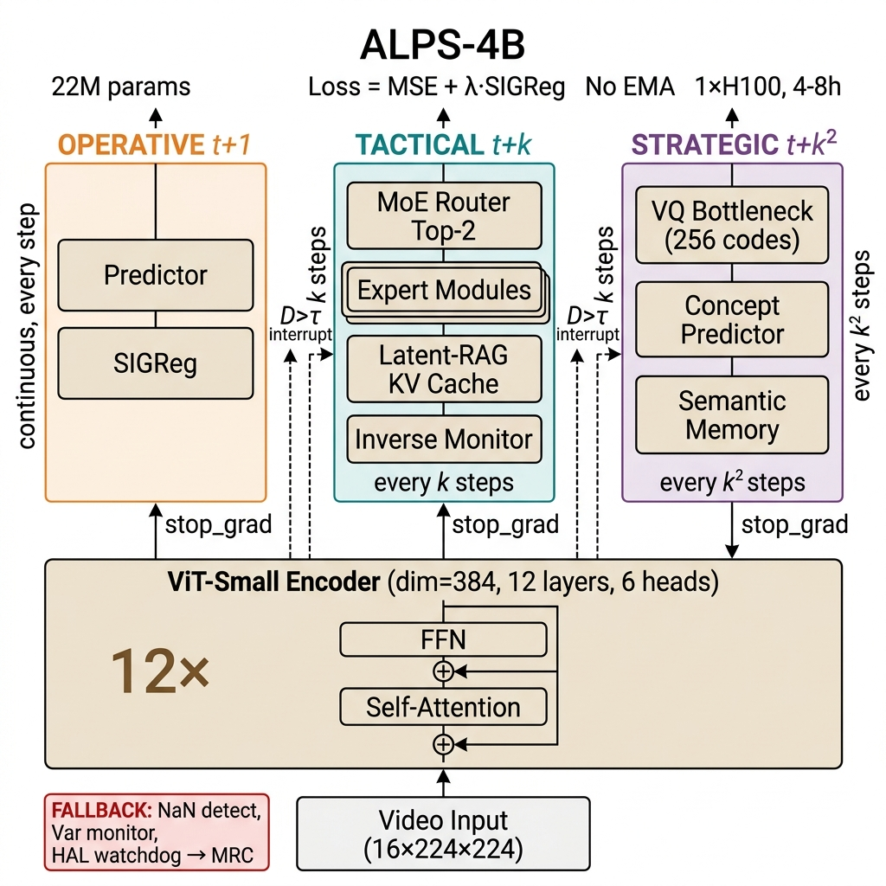
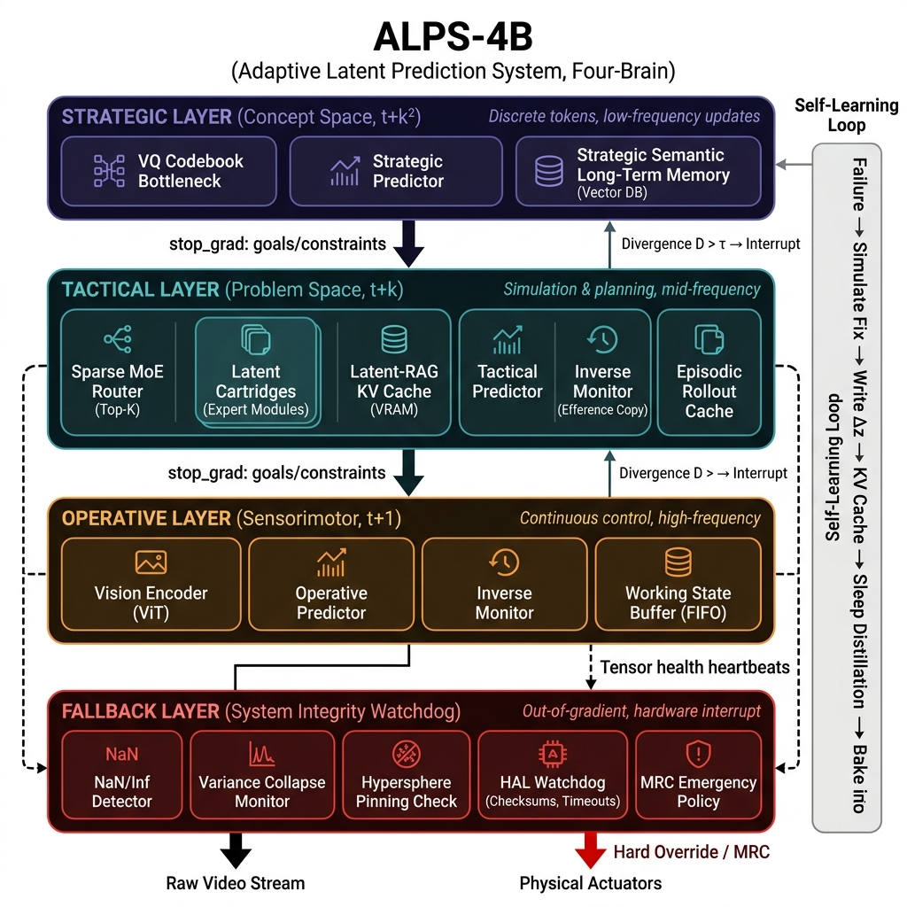

# ALPS-4B: Adaptive Latent Prediction System (Four-Brain)
## Scientific Evidence Repository for the SPRIND Next Frontier AI Challenge

[](LICENSE)
[](docs/scientific_paper.tex)
[](docs/mathematical_foundations.md)
[](docs/comparison_matrix.md)

---

## 🖼️ Full System Architecture

### Publication-Quality Research Paper Diagram


### Complete Wiring & Feedback Loops


---

## 🚀 The Disruptive Paradigm Shift

Autoregressive models (such as modern generative LLMs) process sequences under an $O(n^2)$ attention bottleneck, experiencing a **complexity cliff** over long horizons and accumulating errors until plans diverge. Standard Joint-Embedding Predictive Architectures (JEPAs) operating on flat sequences avoid pixel generation costs, yet they struggle to decouple slow conceptual planning from fast mechanical controls.

**ALPS-4B (Adaptive Latent Prediction System, Four-Brain)** introduces a multi-scale, temporally decoupled JEPA hierarchy that represents the next S-curve of AI:

1. **Strategic Layer (System 2 - Concept Planning)**: Operates at slow temporal frequencies on discrete, conceptual bottleneck coordinates ($c_T$) using a VQ codebook, generating stable long-term plans immune to high-frequency noise.
2. **Tactical Layer (System 2 - Sub-Goal Simulation)**: Conditions on strategic guidance to select spatiotemporal Expert modules via a **Sparse Mixture of Experts (MoE)** router, querying an episodic **Latent-RAG** KV cache to output sub-goal trajectories ($h_T$).
3. **Operative Layer (System 1 - Sensorimotor Control)**: Processes raw visual streams through a spatiotemporal **3D Vision Transformer (ViT)**, running high-frequency predictive loops ($z_{t+1}$) conditioned on physical actions ($a_t$) and tactical sub-goals.
4. **Fallback Watchdog (System Integrity Reflex)**: Operates out-of-gradient to resolve the **JEPA Self-Diagnosis Blind Spot**. Collapsed JEPA layers output constant values and register *perfect (zero) prediction error*. The watchdog monitors representation variance and hypersphere pinning, executing a deterministic **Minimal Risk Condition (MRC)** on trigger.

---

## 🔬 Core Mathematical Innovations

### 1. SIGReg: Sliced Isotropic Gaussian Regularization
To eliminate Momentum Target Encoders, Exponential Moving Averages (EMA), or pre-trained frozen backbones, ALPS-4B prevents representation collapse using **SIGReg** within each layer. Leveraged under the **Cramér-Wold Theorem**, SIGReg projects high-dimensional latents onto $M$ random unit directions. It then enforces standard normality on these 1D slices using the analytical closed-form **Epps-Pulley normality statistic**:

$$T_{n,\beta} = \frac{1}{n} \sum_{j=1}^n \sum_{k=1}^n \exp\left(-\frac{\beta^2}{2}(Y_j-Y_k)^2\right) - 2 \left(1 + \beta^2\right)^{-1/2} \sum_{j=1}^n \exp\left(-\frac{\beta^2 Y_j^2}{2(1+\beta^2)}\right) + \frac{n}{\sqrt{1+2\beta^2}}$$

### 2. Banach Contraction Checker Refinement
Top-down conceptual guidance and bottom-up representations are aligned iteratively. We model the refinement loop as a contraction mapping in a Banach space:
$$d(\mathcal{R}(u), \mathcal{R}(v)) \le L \cdot d(u, v) \quad \text{with } L < 1$$
By the **Banach Fixed-Point Theorem**, this mathematically guarantees geometric convergence to a unique, stable fixed point $z^*$. We enforce this during training via a Lipschitz violation penalty loss.

### 3. Unified EBM Binding
The entire multi-scale hierarchy is bound under a single Energy-Based Model (EBM) landscape:
$$E_{\text{total}}(x, a) = \alpha \cdot E_{\text{strategic}} + \beta \cdot E_{\text{tactical}} + \gamma \cdot E_{\text{operative}}$$
A low total energy represents perfect planning coherence, allowing direct gradient-based planning in latent space.

---

## 🧠 Non-Parametric Lifelong Self-Learning

When the bottom-up **Inverse Monitor** registers a prediction failure (surprise), it computes a latent correction vector $\Delta z = z - \hat{z}$ and writes it to the **Latent-RAG** Key-Value cache.
* **Instant One-Shot Learning**: On subsequent steps, similar contexts query the cache and retrieve the correction vector, correcting predictions **with zero gradient updates**.
* **Sleep Consolidation**: During offline periods, the system audits the cache, identifies frequent failure modes, and trains the Predictor's parametric weights on them before purging the cache.
* **Hive-Mind Fleet Sync**: The episodic KV cache can be copied across a robot fleet instantly, allowing the entire fleet to learn from a single robot's failure without weight opacity.

---

## 📂 Repository Structure

```
4B-JEPA/                                    (GitHub: 4qdrai/4B-JEPA)
├── README.md                               # World-class scientific pitch
├── LICENSE                                  # Apache 2.0
├── CITATION.cff                             # Academic citation
├── pyproject.toml                           # Modern Python packaging
│
├── src/alps/                                # Core Python package
│   ├── __init__.py
│   ├── core/
│   │   ├── encoders.py                      # Vision Encoder (ViT, NO separate target encoder per LeWM)
│   │   ├── predictor.py                     # Multi-scale predictors with AdaLN action integration
│   │   ├── sigreg.py                        # SIGReg regularizer (Epps-Pulley + Weak variant)
│   │   ├── hierarchy.py                     # Strategic/Tactical/Operative orchestrator
│   │   ├── energy.py                        # Multi-scale EBM binding
│   │   ├── vq_bottleneck.py                 # Vector Quantization for Strategic layer
│   │   ├── moe_router.py                    # Sparse MoE Top-K semantic router
│   │   ├── latent_rag.py                    # Non-parametric KV cache + cross-attention retrieval
│   │   ├── inverse_monitor.py               # Efference copy divergence detection + escalation
│   │   ├── checker.py                       # Banach contraction checker networks
│   │   ├── fallback.py                      # System Integrity Monitor (NaN, Var, Pinning, HAL)
│   │   └── alps_model.py                    # Full ALPS-4B orchestrator
│   │
│   ├── memory/                              # 3-Tier Hierarchical Memory
│   │   ├── working_buffer.py                # Operative: FIFO sensorimotor state buffer
│   │   ├── episodic_cache.py                # Tactical: episodic rollout cache with decay
│   │   ├── semantic_memory.py               # Strategic: permanent vector database
│   │   ├── abstraction_scorer.py            # Temporal invariance + dimensional compression metrics
│   │   └── sleep_distillation.py            # Overnight consolidation: audit → distill → purge
│   │
│   ├── multimodal/                          # Vision-Primary Multi-Modal
│   │   ├── vision_encoder.py                # Primary ViT video encoder (always-on)
│   │   ├── sensor_encoders.py               # Auxiliary sensor encoders (LiDAR, IMU, etc.)
│   │   └── modality_router.py               # Strategic-layer sensor budget allocation
│   │
│   ├── training/                            # Self-Supervised Training
│   │   ├── masked_prediction.py             # Spatiotemporal tube masking (90% ratio)
│   │   ├── multi_scale_loss.py              # Per-layer LeWM loss + inter-layer stop-grad
│   │   ├── phase_shifted_scheduler.py       # Per-layer update frequency scheduling
│   │   └── train.py                         # Main H100 training script
│   │
│   ├── evaluation/                          # Benchmarks
│   │   ├── linear_probe.py
│   │   ├── complexity_cliff.py              # Sequence-length scaling comparison
│   │   └── representation_quality.py        # SIGReg covariance eigenvalue analysis
│   │
│   └── simulations/                         # Evidence-Generating Simulations
│       ├── convergence_analysis.py           # Banach contraction rate visualization
│       ├── sigreg_analysis.py               # Covariance spread + collapse prevention demo
│       ├── moe_scaling.py                   # O(1) FLOPs proof with scaling experts
│       ├── self_learning_demo.py            # End-to-end failure→learn→recall demo
│       └── hive_mind_demo.py                # Fleet KV sync demonstration
│
├── docs/                                    # Publication-Quality Documentation
│   ├── scientific_paper.tex                 # NeurIPS LaTeX Paper
│   ├── scientific_paper.md                  # NeurIPS Markdown version (NEW)
│   ├── mathematical_foundations.md          # Full proofs: SIGReg, Banach, EBM binding
│   ├── comparison_matrix.md                 # Systematic competitor analysis
│   └── training_methodology.md              # Unsupervised training deep-dive
│
├── tests/                                   # 100+ Automated Tests
│   ├── test_sigreg.py
│   ├── test_encoders.py
│   ├── test_hierarchy.py
│   ├── test_moe_router.py
│   ├── test_latent_rag.py
│   ├── test_inverse_monitor.py
│   ├── test_fallback.py
│   ├── test_memory.py
│   ├── test_checker.py
│   └── test_alps_model.py
│
├── scripts/
│   ├── runpod_setup.sh                      # H100 environment setup
│   ├── download_ucf101.sh
│   └── run_training.sh
│
├── results/                                 # Training artifacts
│   ├── h100_training/
│   └── simulations/
│
└── figures/                                 # Publication figures
    ├── architecture_diagram.png
    ├── training_curves.png
    └── sigreg_covariance.png
```

---

## 🛠️ Codebase Setup and Verification

### Prerequisites
Make sure PyTorch, PyTest, and modern packaging utilities are installed.

### 1. Run Automated Test Suite
Verify the mathematical correctness and integrity of all system components:
```bash
$env:PYTHONPATH="src"
pytest -v
```

### 2. Run Empirical Simulations
Generate scientific figures and metrics proving our disruptive claims:
```bash
$env:PYTHONPATH="src"
# 1. Banach checker convergence
python src/alps/simulations/convergence_analysis.py
# 2. SIGReg covariance spread
python src/alps/simulations/sigreg_analysis.py
# 3. O(1) Sparse MoE FLOP scaling
python src/alps/simulations/moe_scaling.py
# 4. Zero-Retraining failure corrections
python src/alps/simulations/self_learning_demo.py
# 5. Hive-Mind fleet synchronization
python src/alps/simulations/hive_mind_demo.py
```

### 3. Run Unsupervised Training Pipeline
Simulate training ViT spatiotemporal features from raw video inputs:
```bash
$env:PYTHONPATH="src"
python src/alps/training/train.py
```
Outputs final trained model weights to `results/h100_training/alps4b_final.pt`.
