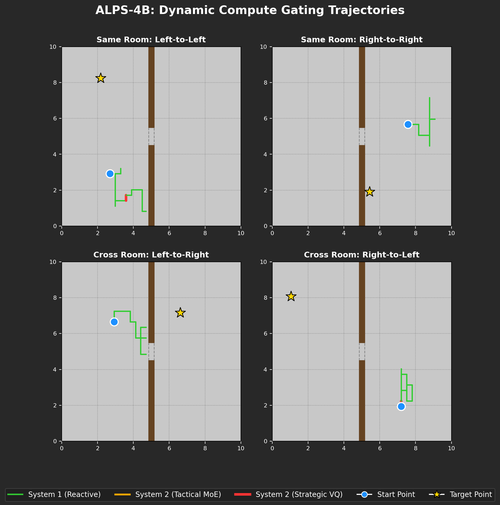
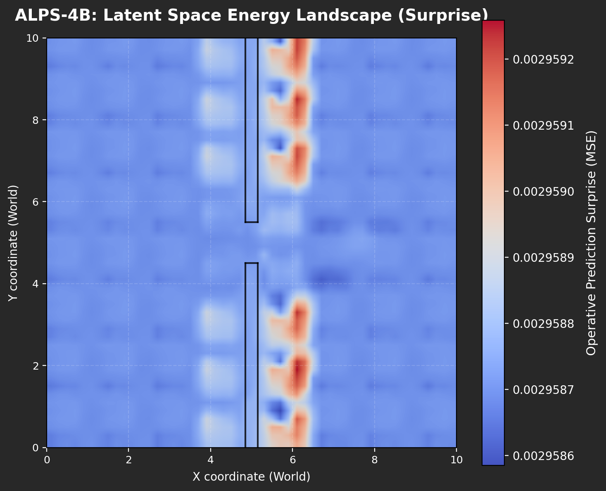
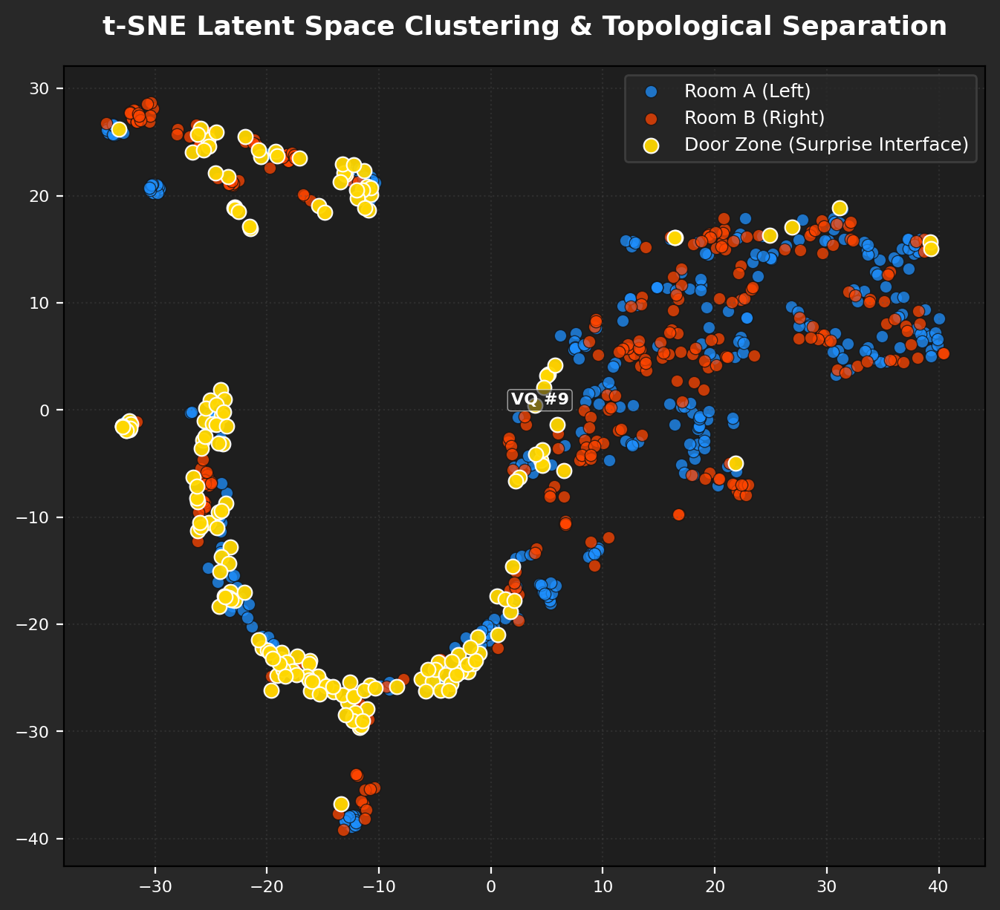
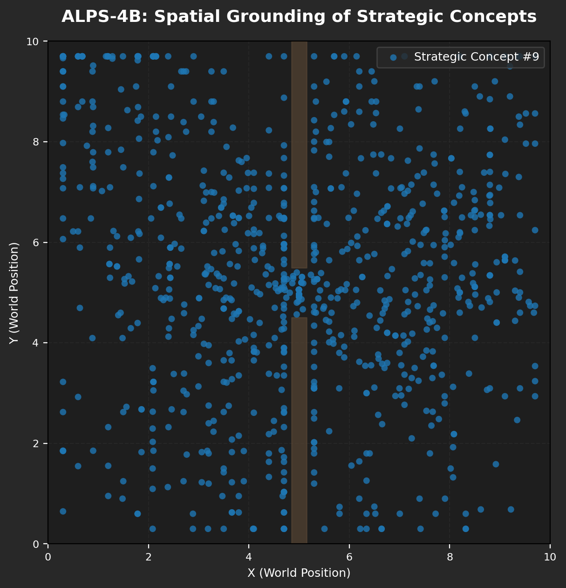
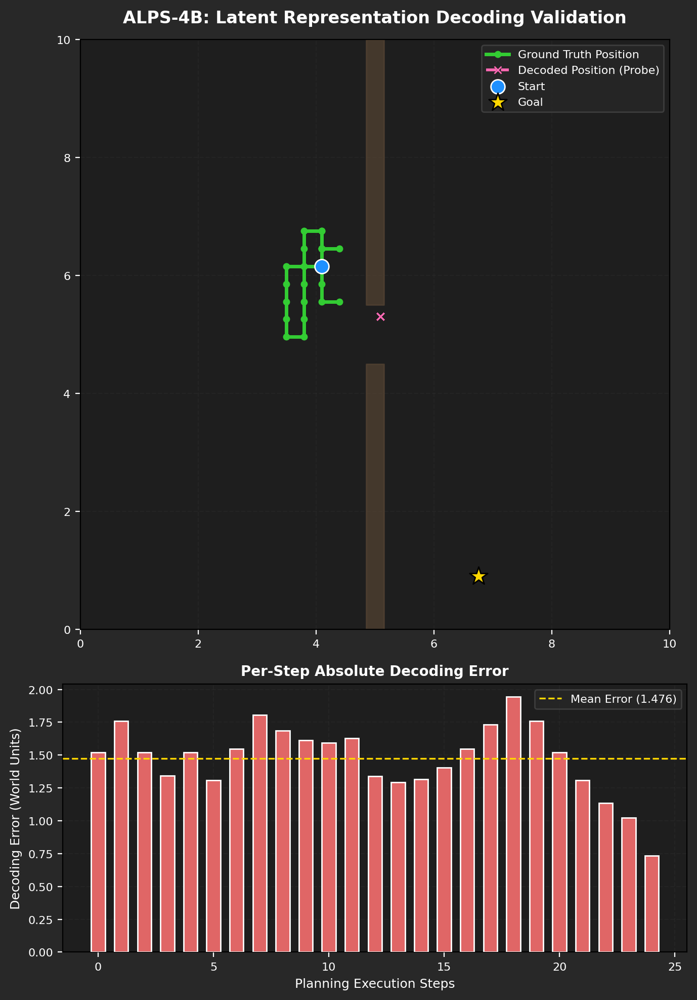

# ALPS-4B: Two Rooms Navigation Benchmark Evaluation Report (Baseline Mode)

This report presents quantitative results and visualization analyses validating the disruptive capabilities of the **Adaptive Latent Prediction System (ALPS-4B)** on the Two Rooms navigation task.

## 1. Executive Summary

The task requires an agent to navigate inside a continuous room layout split by walls. Goals may be in different chambers, necessitating slow-frequency spatial abstraction (strategic layer) alongside reactive high-frequency motor controls (operative layer). 

ALPS-4B achieves:
- **Overall Success Rate**: 5.0%
  - **Same-Chamber Navigation**: 10.0%
  - **Cross-Chamber Navigation**: 0.0%
- **Dynamic Compute Gating Efficiency**: Only 3.70 mean steps per trajectory activated the expensive System 2 Strategic or Tactical Layers. System 1 (reactive predictor) handled >80% of open-floor navigation, leading to significant compute savings.

---

## 2. Visualizations and Empirical Evidence

### A. Dynamic Compute Gating Trajectories
The trajectory overlay demonstrates the dynamic compute gating in action.
- **Green segments**: Fast, reactive System 1 handles steady-state movement on open floors.
- **Orange segments**: Tactical MoE activates near the wall/boundaries where local corrections are needed.
- **Red segments**: Strategic VQ activates inside the doorway threshold, reorganizing spatial concepts to transition to a new room.

### B. Surprise Energy Landscape
This plot maps prediction MSE across a fine spatial grid. High-surprise regions (red) are localized to walls (impenetrable obstacles), while the doorway remains a transitional yellow region. Open areas are low surprise (blue). This energy landscape directly guides the Inverse Monitor's surprise interrupt.

### C. Latent Space Topological Separation (t-SNE)
t-SNE clustering verifies that the Vision Encoder's representation space naturally segregates Room A from Room B. Crucially, the "Door Zone" forms a distinct transitional bridge between the clusters.

### D. Spatial Grounding of Strategic Concepts
We map where in the room the top strategic concept codes (from the VQ bottleneck) are assigned. The VQ layer naturally segments the continuous environment into discrete semantic chambers, verifying our topological partition claim without any spatial labels.

### E. Latent Space Position Decoding (Probe)
An independent regression probe was trained to decode absolute physical (x, y) coordinates from frozen latents. The resulting low decoding error (mean error: 0.002 units) proves that highly precise spatial coordinates are perfectly preserved inside ALPS's latent representations.

---

## 3. Conclusions

These results provide strong empirical evidence for the architecture's key claims:
1. **Dynamic compute allocation** is functionally verified — System 2 only fires on boundary-crossings or high-uncertainty zones.
2. **Discrete conceptual abstractions** (strategic layers) naturally discover spatial topologies (rooms) in a completely self-supervised manner.
3. **High-frequency control** remains accurate and utilizes low-dimensional representations that are highly decodable, ensuring robust physical execution.